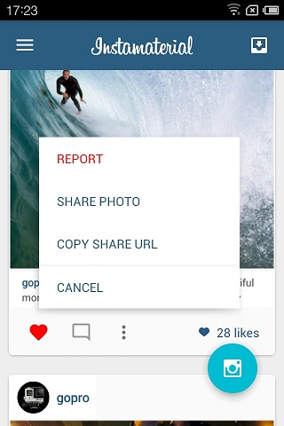
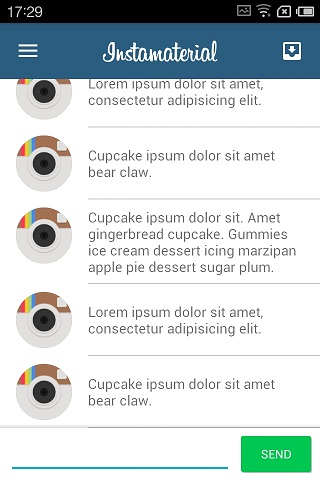
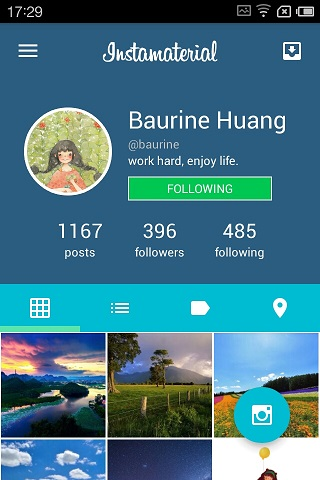
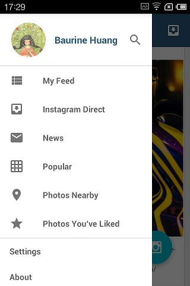
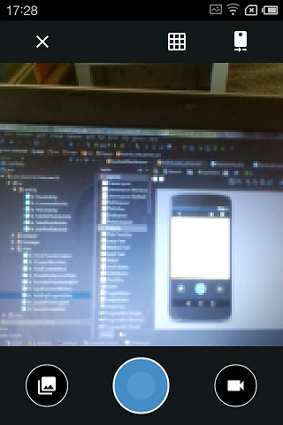
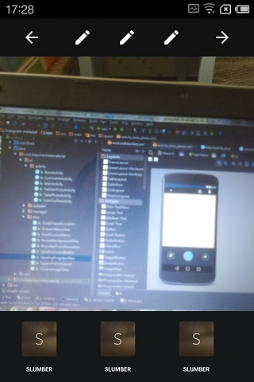
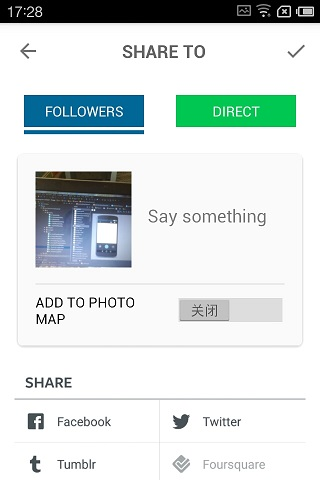
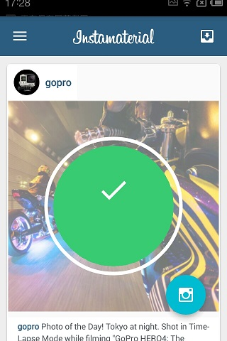
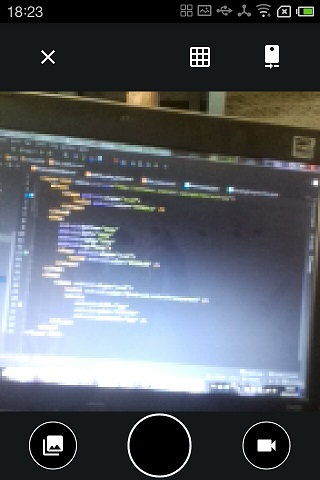
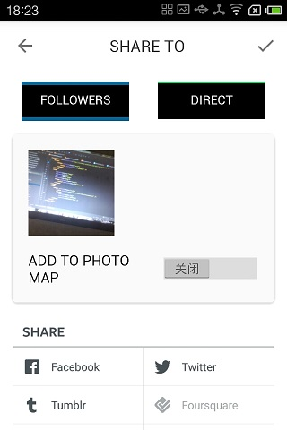

# Instagram Material

完全是跟着下面的教程一步一步完成的。

1. [英文原文](http://frogermcs.github.io/Instagram-with-Material-Design-concept-is-getting-real-the-summary/)
2. [中文翻译](http://www.jcodecraeer.com/a/anzhuokaifa/androidkaifa/2015/0509/2852.html)

中文翻译的第三章有部分内容缺失，所以尽量还是看原文。

虽然不是自己设计实现的，但还是非常有成就感。感谢作者及译者。

我从这篇教程中受益颇深，学习到了各种动画的制作，理解了动画的精髓 (通过位移，尺度，透明度等的变化及其组合来实现)，高级控件的使用，自定义 View 的实现，以及良好的代码风格。

最终的实现效果正如 [youtube](https://www.youtube.com/watch?v=VpLP__Vupxw) 中演示的一样。细微部分有所差别。

在学习过程中，对这个项目做了一些修改和调整。

1. 使用官方 Support Design 库的 FAB 替代作者自己的实现。原本也想用官方的 NavigationView 来实现 Drawer，但觉得作者用注入的思想也很不错，所以就没有修改。
2. 增加了取消 like 的功能及其动画效果。解决作者项目中滑动 feeds 时 like 数自动加一的问题。
3. 解决了部分按钮 (照相按钮及选择发布对象的按钮) 在 Meizu MX (我的测试机，Android 4.1.1，API 16) 上显示异常的问题。(在 MX 上，如果一个按钮 backgroud 是 layer-list，顶层的 item 缕空部分默认不是透明的，因此会覆盖掉底层的 item，必须手动声明为 transplant)。
4. 部分用 LinearLayout 嵌套太深的布局，用 RelativeLayout 替代。微调了部分布局。

项目中用到的图片资源皆来自作者项目及[花瓣网](http://huaban.com/)，如有侵权本人会马上删除。

接下来的计划，我想在这个项目的 UI 基础上，尝试使用 [LeanCloud SDK](https://leancloud.cn/) 来实现真正的功能，包括登录，发布照片，点赞，评论，关注等，并仿照作者写成一系列的教程，敬请期待。

#### 截图
Feeds

Comments

UserProfile

Drawer

TakePhoto

EditPhoto

PublishPhoto

SendingPhoto

#### MX 上按钮异常的解决办法
拍照按钮异常 (正常的情况看上面的截图)

解决办法：

    <layer-list xmlns:android="http://schemas.android.com/apk/res/android">
        <item>
            <shape android:shape="oval">
                <solid android:color="#458dca" />
            </shape>
        </item>
        <item
            android:bottom="16dp"
            android:left="16dp"
            android:right="16dp"
            android:top="16dp">
            <shape android:shape="oval">
                <solid android:color="#529bd8" />
            </shape>
        </item>
        <item>
            <shape android:shape="oval">
                <!--增加这一行代码，把缕空部分声明为透明-->
                <solid android:color="@android:color/transparent" />
                <stroke
                    android:width="2dp"
                    android:color="#ffffff"
                    android:dashWidth="0dp" />
            </shape>
        </item>
    </layer-list>

选择发布对象按钮异常 (正常的情况看上面的截图)

解决办法：
我觉得作者的实现稍微复杂，作者是在底层绘制了一个 rectangle，然后在顶层用白色边框包围住底层的 rectangle。解决办法同上，需要把顶层缕空部分声明为 transparent，但我自己换了一种实现方法，先在底层绘制了纯色的 rectangle，然后在它下面绘制了一条相同颜色的 line。实现代码 (摘自 `switch_publish_followers.xml`)：

    <layer-list>
        <item android:bottom="8dp" android:top="8dp">
            <shape android:shape="rectangle">
                <solid android:color="#006699" />
            </shape>
        </item>
        <item android:left="-4dp" android:right="-4dp" android:top="42dp">
            <shape android:shape="line">
                <stroke android:width="4dp" android:color="#006699" />
            </shape>
        </item>
    </layer-list>